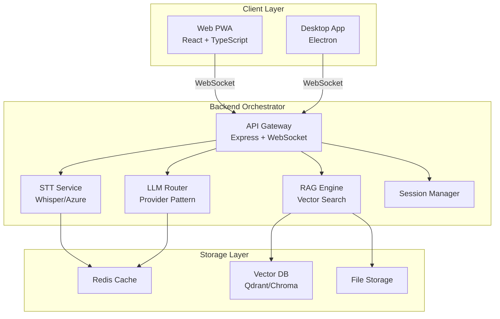
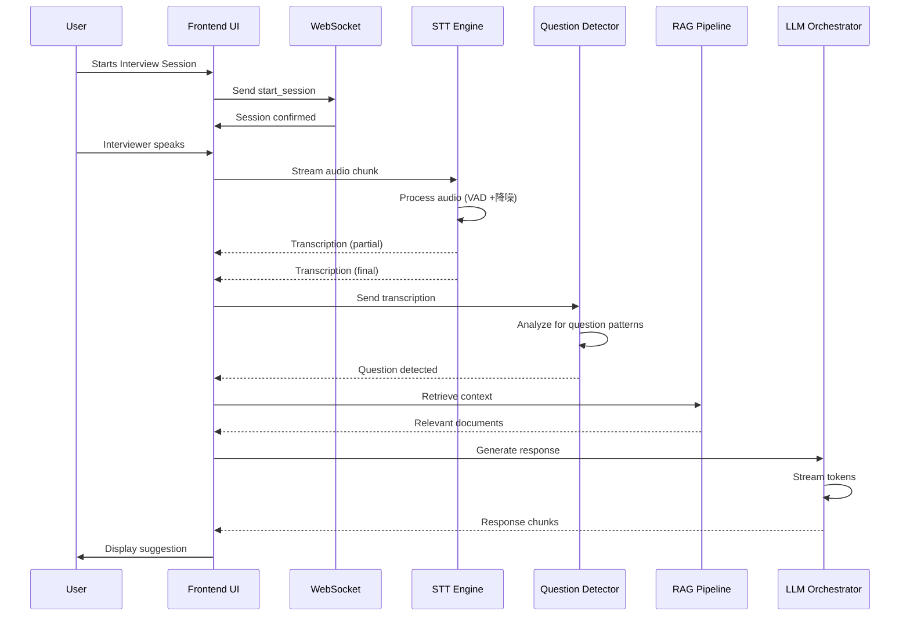
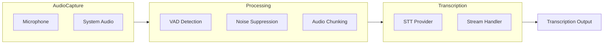
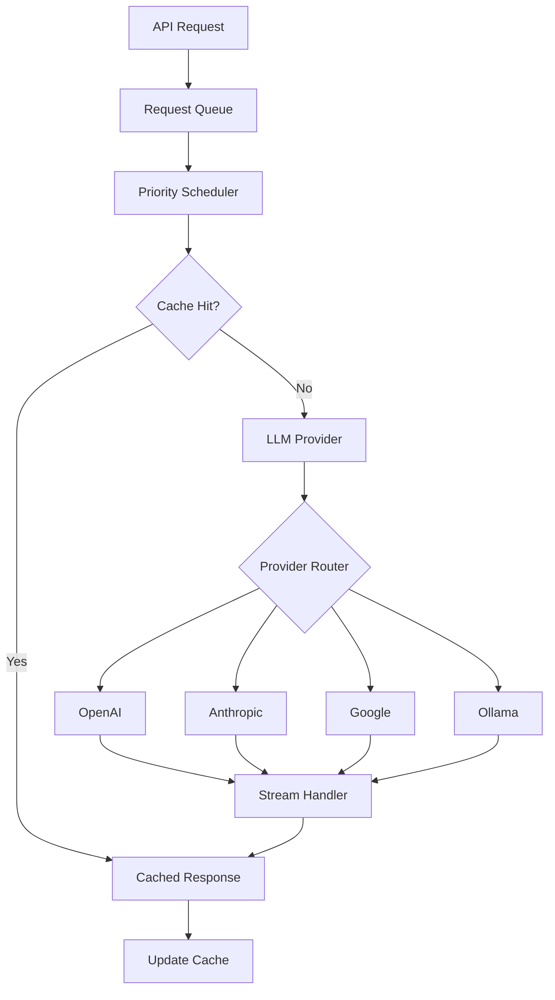
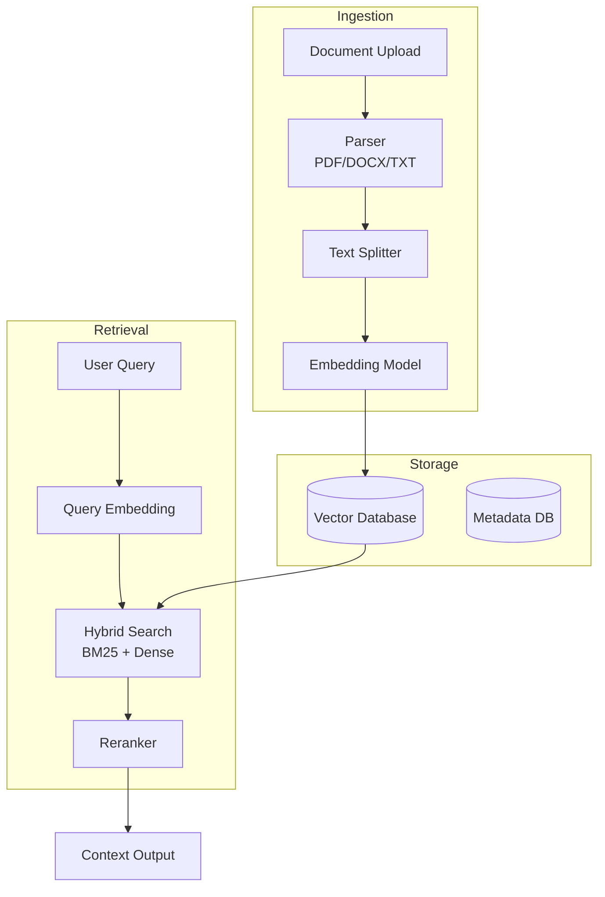
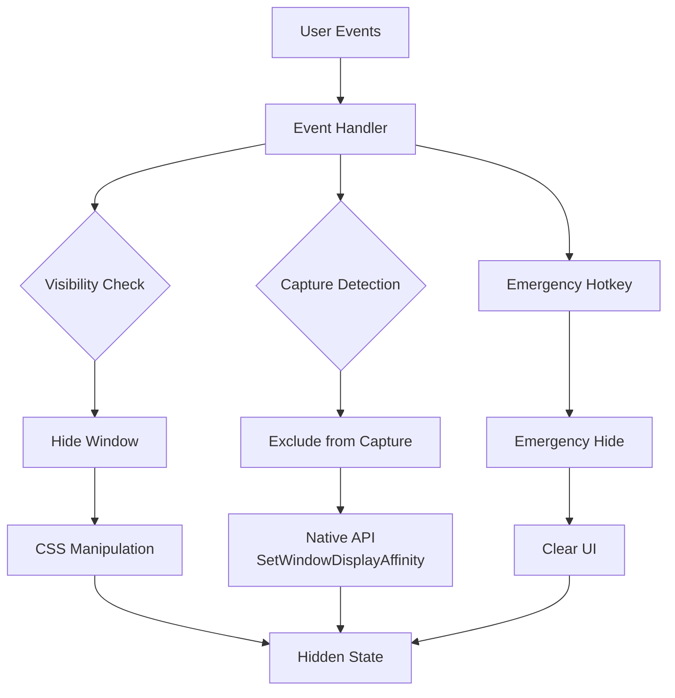
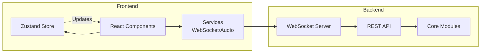
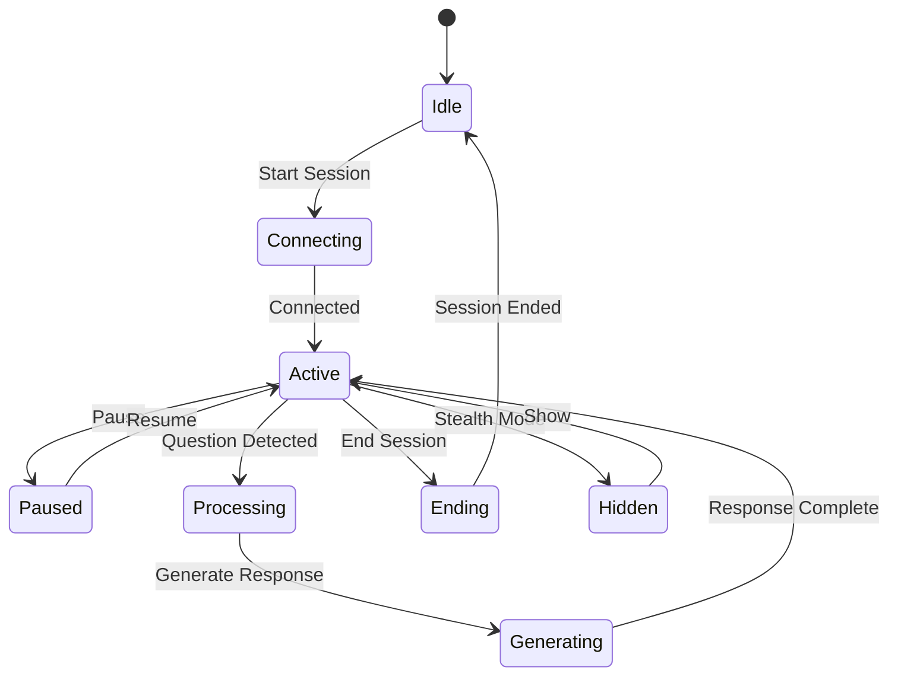
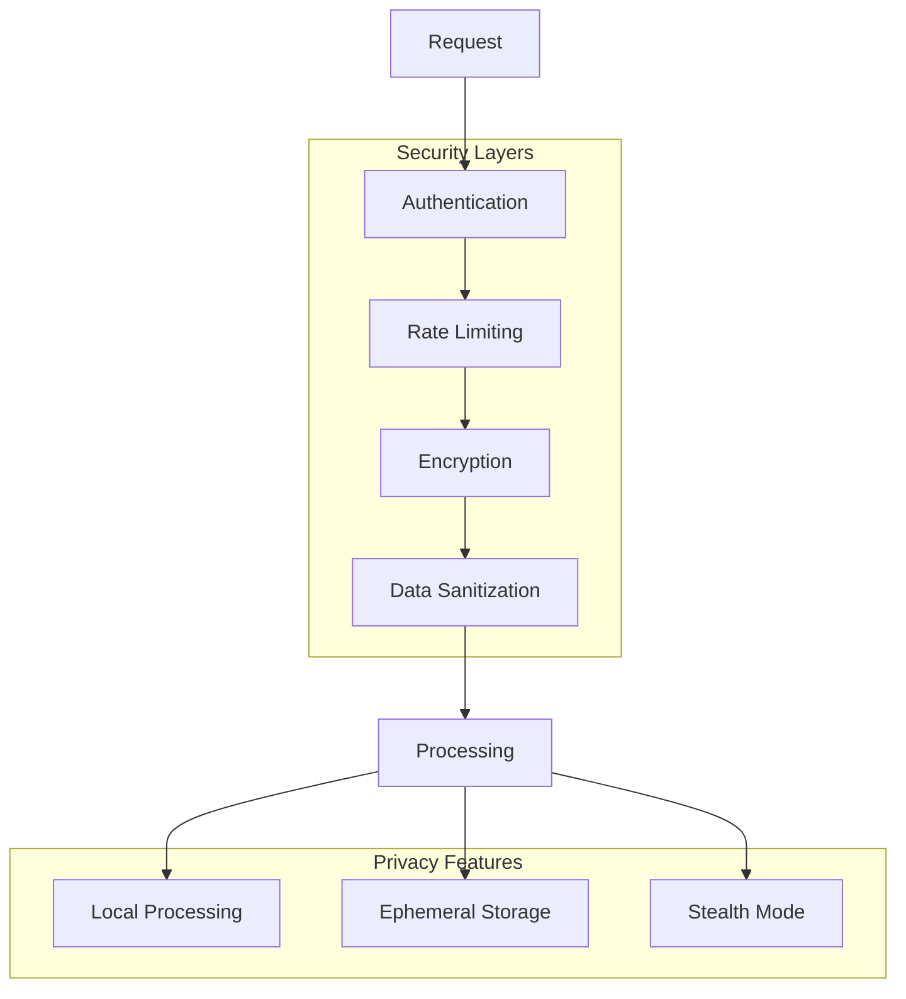
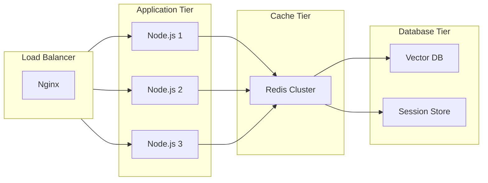

# Architecture Documentation

## System Overview

## Data Flow

## Module Architecture

### 1. STT Engine

### 2. LLM Orchestrator

### 3. RAG Pipeline

### 4. Stealth Engine

## Component Interactions

## State Management

## Technology Stack

| Layer | Technology | Purpose |
|-------|------------|---------|
| Frontend | React 18 | UI Framework |
| State | Zustand | State Management |
| Styling | TailwindCSS | CSS Framework |
| Backend | Node.js + Express | API Server |
| Real-time | WebSocket | Bi-directional Communication |
| STT | Whisper.cpp/Azure | Speech-to-Text |
| LLM | OpenAI/Anthropic | Response Generation |
| RAG | LangChain | Document Processing |
| Vector | bge-small-zh | Embeddings |
| Desktop | Electron | Cross-platform App |

## Security Architecture

## Performance Targets

| Metric | Target | Current |
|--------|--------|---------|
| End-to-end Latency | < 2s | ~500ms (mock) |
| STT Processing | < 300ms | ~100ms |
| LLM Response | < 1.5s | ~800ms |
| Memory Usage | < 300MB | ~150MB |
| CPU Usage | < 15% | ~8% |

## Scalability

---

For implementation details, see individual module documentation in `/docs/modules/`.
